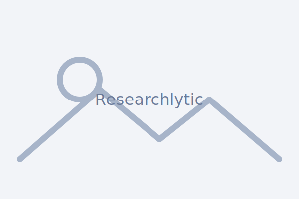

# Researchlytic – Research Trends Landing Page

This repository contains a lightweight marketing page for **Researchlytic**, showcasing the research intelligence features that power [researchlytic.com](https://researchlytic.com/research-trends/). It is designed as a static site that you can host anywhere (GitHub Pages, Netlify, Vercel, etc.) or simply open locally in a browser.

## Preview



> Replace the image above with a hero screenshot of your product for a richer preview.

## Features highlighted on the page

The page mirrors the key sections of the Researchlytic experience:

1. Publication interest over time
2. Advanced search refinement
3. Studies, SCR and SCRP metrics
4. Leading countries analytics
5. Institutional research insights
6. Subjects and subtopics discovery
7. Publisher landscape
8. Key journals spotlight
9. Leading researchers overview
10. Research format breakdown
11. Open access publishing trends
12. Highly impactful studies
13. Recent developments feed

Each section includes a placeholder image that you can replace with the real screenshots you mentioned.

## Project structure

```
researchlytic/
├── index.html            # Static landing page markup
├── styles/
│   └── main.css          # Styling for the landing page
├── assets/
│   └── placeholder.svg   # Temporary artwork until real screenshots are added
└── README.md             # You are here
```

## Getting started

1. Clone the repository or download the source.
2. Open `index.html` directly in your browser to preview the page.
3. Optionally, serve the project with a simple static server for live reloading:
   ```bash
   npx serve
   ```
   > Any static file server will work – choose the one you prefer.

## Adding your real screenshots

1. Replace `assets/placeholder.svg` with the screenshots for each section (JPG, PNG, or WebP all work).
2. Update the `` `src` paths in `index.html` if you decide to rename files per section. The `data-feature` attribute on every image indicates which section it belongs to.
3. Commit the new assets so your deployment picks them up.

## Customising the content

- **Text** – Update the copy directly in `index.html` to match new messaging.
- **Styling** – Adjust colours, typography, or layout in `styles/main.css`.
- **Sections** – Add or remove `<section class="feature-card">...</section>` blocks inside the main grid as your product evolves.

## Deployment tips

- **GitHub Pages** – Enable Pages for the repository and point it to the `main` branch root. The site will be live at `https://<your-username>.github.io/researchlytic/`.
- **Netlify/Vercel** – Drag-and-drop the folder in their dashboards or connect the Git repo. Since this is a static build, no additional configuration is necessary.

## License

All product copy and screenshots remain proprietary to Researchlytic. The static scaffolding in this repository is provided so you can manage and deploy your own marketing site.
