# Researchlytic

🌐 [Live Demo](https://researchlytic.com/research-trends/)

**Researchlytic** is a research trend analytics platform that helps you discover what the world is researching.  
It provides insights into publication interest, research activity, leading institutions, impactful studies, and more.

---

## 🔎 Key Features

- **Search by Research Topic** – Enter a keyword and explore trends in global research.
- **Publication Interest Over Time** – Track how popularity changes across years.
- **Advanced Filters** – Narrow down results by location, period, subject, or study type.
- **Research Metrics (Studies, SCR, SCRP)** – Understand research activity and impact.
- **Top Countries & Institutions** – Identify who’s leading research in your area.
- **Subjects & Subtopics** – Explore connected research fields.
- **Publishers & Journals** – Find out who publishes the most in your domain.
- **Leading Researchers** – Discover the most active contributors in the field.
- **Research Types** – Differentiate between papers, chapters, proceedings, etc.
- **Open Access Trends** – Compare open vs closed publishing patterns.
- **Highly Impactful Studies** – Spot studies that shaped the research domain.
- **Recent Developments** – Stay updated with the latest publications.

---

## 📸 Screenshots

### Enter a Research Term or Topic
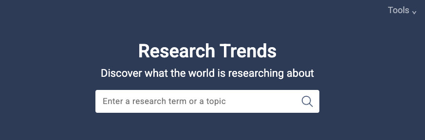

### Publication Interest Over Time
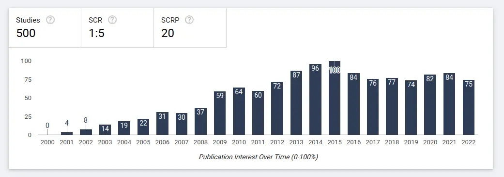

### Refine Your Search
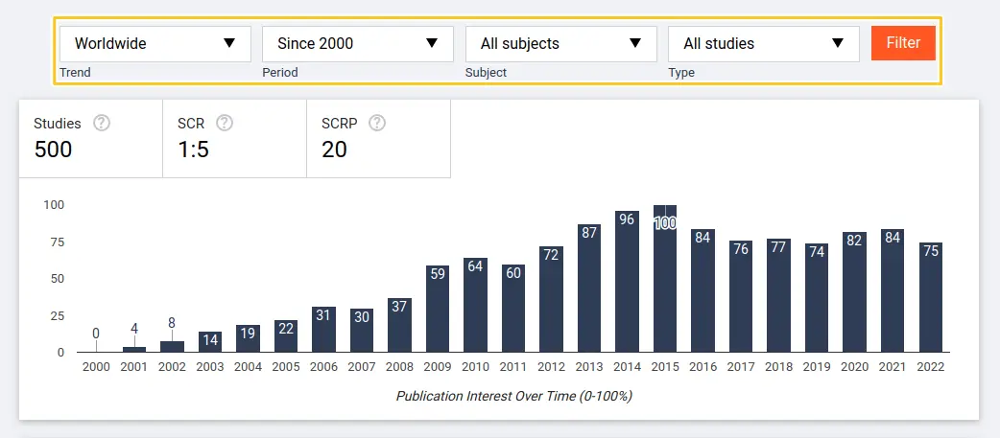

### Studies, SCR and SCRP
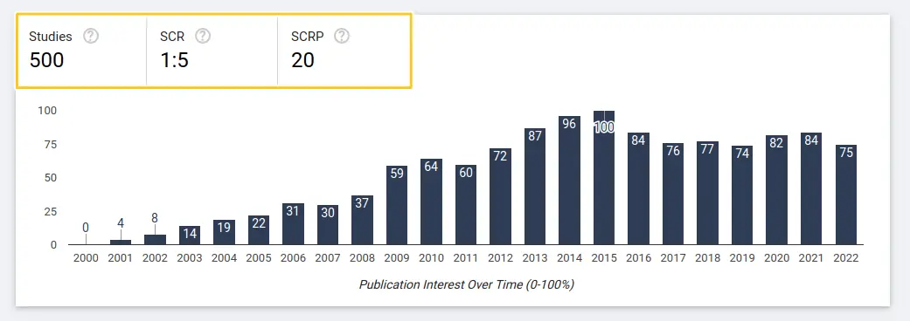

### Leading Countries in Your Research Area
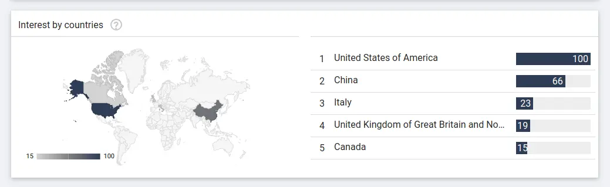

### Research Interest by Institutions
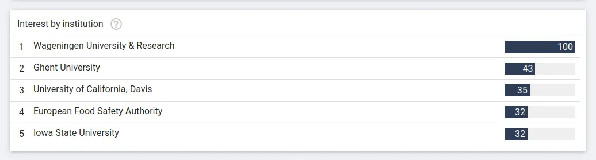

### Research Subjects and Subtopics
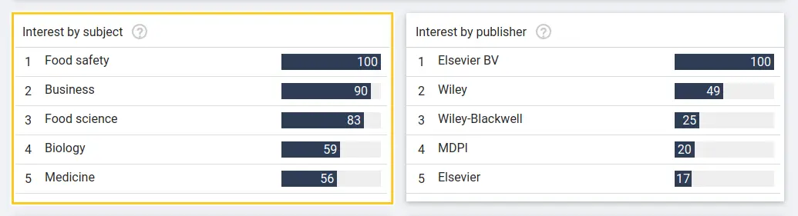

### Publishers in Your Research Domain
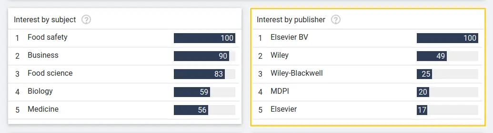

### Key Journals in Your Research Interests
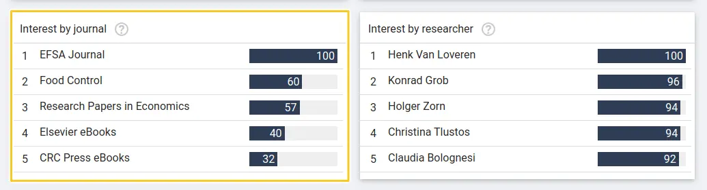

### Leading Researchers in Your Topic
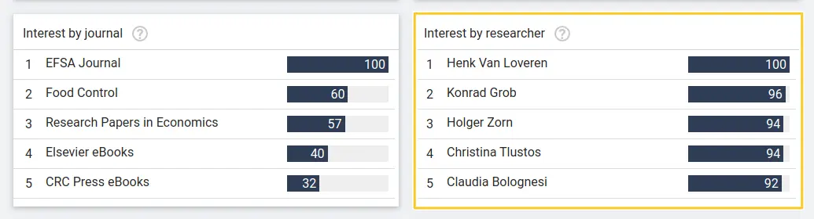

### Research Types in Your Field
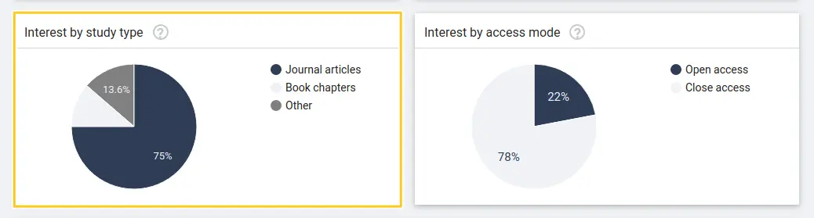

### Open Access Publishing Trends
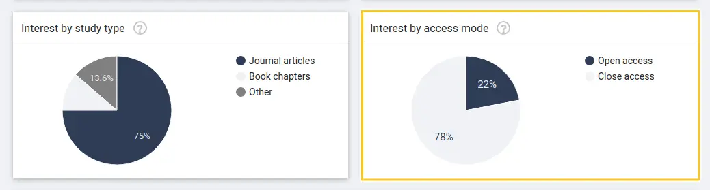

### Highly Impactful Studies

### Recent Developments in Research
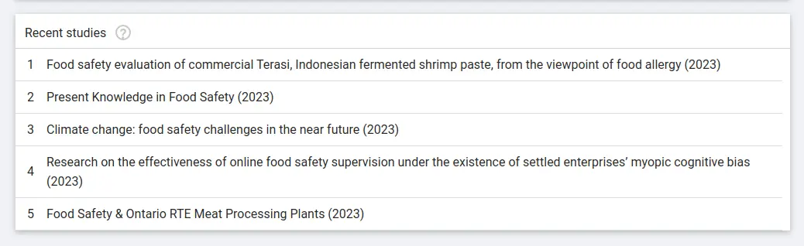

---

## 🚀 Live Demo

🔗 [Visit Researchlytic](https://researchlytic.com/research-trends/)

---

## 📌 About

This is a personal portfolio project. The code is private, but you can explore the live demo to experience the platform’s features in action.  

---

## 📬 Contact

If you'd like to connect or collaborate:  
- 🌐 Website: [researchlytic.com](https://researchlytic.com)  
- 💼 LinkedIn: www.linkedin.com/in/muhammad-tayyab-nlp

---
